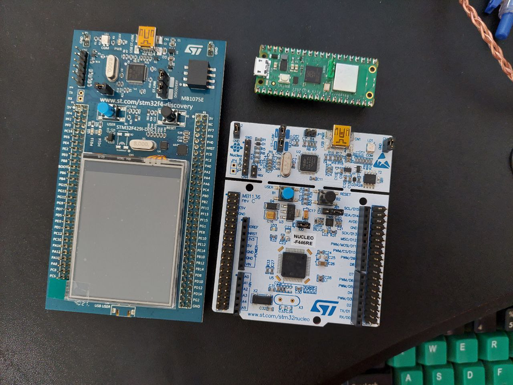
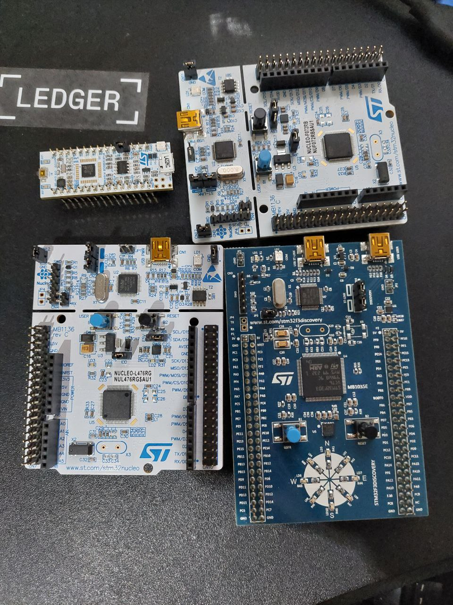

### Hi there 👋
- 🌱 Currently learning: aws, web3, assembly & microcontroller (AVR, STM32, and Raspberry Pi Pico)
- 🐧 Arch linux and Fedora
- languages: C, Typescript, C#, Golang and Python.
- else: AWS, GCP, docker and kubernetes

<!--
**khofesh/khofesh** is a ✨ _special_ ✨ repository because its `README.md` (this file) appears on your GitHub profile.

Here are some ideas to get you started:

- 🔭 I’m currently working on ...
- 🌱 I’m currently learning ...
- 👯 I’m looking to collaborate on ...
- 🤔 I’m looking for help with ...
- 💬 Ask me about ...
- 📫 How to reach me: ...
- 😄 Pronouns: ...
- ⚡ Fun fact: ...
-->

### NFT from Buildspace 
[Buildspace: Build a Solana App | Cohort Alkes | #184](https://opensea.io/assets/matic/0x3cd266509d127d0eac42f4474f57d0526804b44e/2822/)

[Buildspace: Solana NFT Collection | Cohort Alkes | #114](https://opensea.io/assets/matic/0x3cd266509d127d0eac42f4474f57d0526804b44e/5089/)

[Buildspace: Build a Web3 App: Mint Your Own NFT collection | Cohort Deneb | #39](https://opensea.io/assets/matic/0x3cd266509d127d0eac42f4474f57d0526804b44e/2084/)

[Buildspace: Intro to Web3 | Cohort Felis | #11](https://opensea.io/assets/matic/0x3cd266509d127d0eac42f4474f57d0526804b44e/1445/)

### MCUs & MPUs

#### STM32

> https://wiki.st.com/stm32mcu/wiki/Category:Getting_started_with_STM32_:_STM32_step_by_step
> https://wiki.st.com/stm32mpu/wiki/How_to_get_started_with_STM32CubeIDE_from_scratch
> https://github.com/m3y54m/Embedded-Engineering-Roadmap \
> https://github.com/gurugio/lowlevelprogramming-university

- https://github.com/khofesh/nucleo-f446re
- https://github.com/khofesh/stm32f429
- https://github.com/khofesh/udemy-mcu3
- https://github.com/khofesh/stm32mp157f
- https://github.com/khofesh/bare-metal-stm32l4
- https://github.com/khofesh/bare-metal-nucleo-l432kc
- https://github.com/khofesh/bare-metal-nucleo-f072rb
- https://github.com/khofesh/bare-metal-stm32f3
- https://github.com/khofesh/bare-metal-stm32f407
- https://github.com/khofesh/bare-metal-stm32f7
- https://github.com/khofesh/stm32-keyestudio-others

#### Raspberry Pi

- https://github.com/khofesh/raspberry-pi-pico-w
- https://github.com/khofesh/iot-in-c

#### ESP32

- https://github.com/khofesh/esp32-c3
- https://github.com/khofesh/esp32-s3
- https://github.com/khofesh/esp32-e

#### Beaglebone
- https://github.com/khofesh/beaglebone-black
- https://github.com/khofesh/beaglebone-ai-64

#### WCH
- https://github.com/khofesh/wch

#### Other
- https://github.com/khofesh/arduino-nano-ble-sense (rev 2)
- https://github.com/khofesh/microbit-v2
- https://github.com/khofesh/linux-kernel-module-programming

### FPGA

- https://github.com/khofesh/fpga-icestick
- https://github.com/khofesh/fpga-go-board

### SIMD
- https://github.com/khofesh/simd-cpp

<!---  --->
