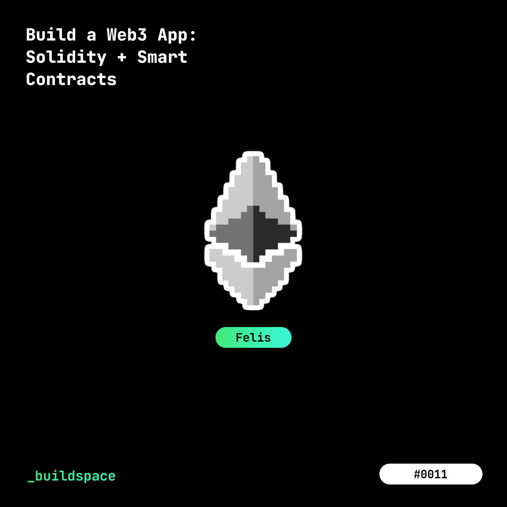
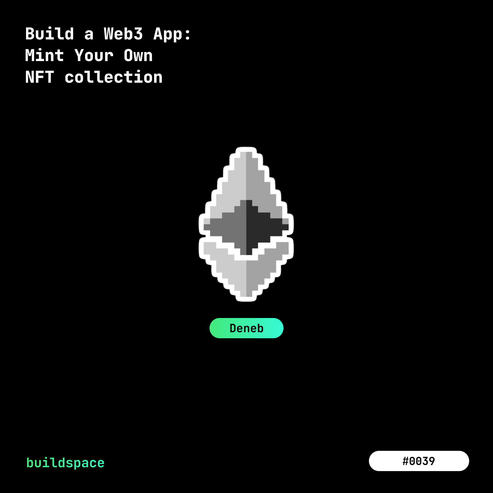

### Hi there 👋
- 🌱 Currently learning: web assembly, flutter, kotlin, and solidity
- 🐧 Arch linux and Fedora
- languages: Javascript, Typescript, C, Golang and Python.
- containerization: docker and kubernetes

<!--
**khofesh/khofesh** is a ✨ _special_ ✨ repository because its `README.md` (this file) appears on your GitHub profile.

Here are some ideas to get you started:

- 🔭 I’m currently working on ...
- 🌱 I’m currently learning ...
- 👯 I’m looking to collaborate on ...
- 🤔 I’m looking for help with ...
- 💬 Ask me about ...
- 📫 How to reach me: ...
- 😄 Pronouns: ...
- ⚡ Fun fact: ...
-->

